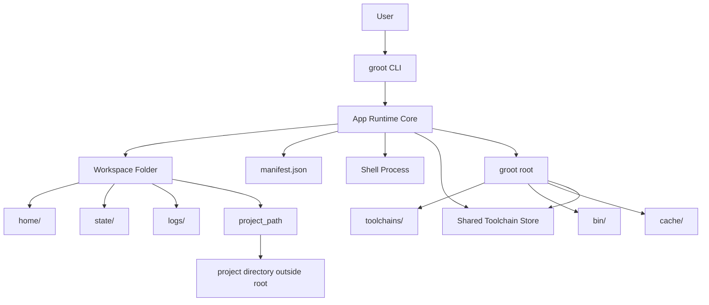

## 🪴 Groot

Groot is a workspace-first runtime layer for local development.

It gives each workspace its own home directory and manifest, while keeping shared runtime state under a single `~/.groot` root. The current version is focused on workspace lifecycle, manifest management, project binding, toolchain installation, and shell activation.

## Product Goal

Groot is meant to provide a reproducible project environment that can be created, opened, exported, and recreated on other machines without polluting the user's normal machine profile.

The intended split is:

- Project runtime state should belong to Groot.
- Project-scoped agent state should belong to Groot.
- GUI IDE identity should remain compatible with the user's normal machine profile.

The agent-facing direction is for Groot to expose the same runtime core through MCP, instead of making agents depend on ad hoc shell scripting.

The current MCP direction is documented in [docs/agent.md](/Users/aristotelistriantafyllidis/Documents/groot/docs/agent.md).

## Phase Model

Groot is being built in deliberate phases:

- Phase 1: workspace-first runtime for local development
- Phase 1.5: MCP control plane over the same runtime
- Phase 2: intent compiler and planning surface on top of external agents
- Phase 3: deeper GOS-style runtime evolution only if the earlier phases prove daily value

This matters because Groot is not trying to become a general-purpose agent product. The runtime comes first. MCP is the structured adapter. Planning comes later on top of the same primitives.

The next architectural bridge toward the longer-term GOS direction is:

- workspace ownership
- task ownership
- service ownership
- event ownership

That runtime direction is defined in [docs/runtime-model-v1.md](/Users/aristotelistriantafyllidis/Documents/groot/docs/runtime-model-v1.md).

## Current Scope

- Initialize a Groot root under `~/.groot`
- Enter a project path by resolving or auto-creating the matching workspace
- Execute one-off commands against a project path by resolving or auto-creating the matching workspace
- Open a project path by resolving or auto-creating the matching workspace
- Export an existing workspace contract from a project path as portable JSON
- Import a portable workspace contract onto an existing local project path
- Print runtime ownership status for a project path by resolving or auto-creating the matching workspace
- Create and delete workspaces
- Bind a workspace to an existing project directory
- Clear a workspace project binding
- Attach toolchain requirements to a workspace manifest
- Install attached toolchains into the shared Groot toolchain root
- Garbage collect unreferenced toolchains from the shared store
- Open a workspace shell with workspace-scoped `HOME` and XDG directories
- Run one-off commands inside the workspace runtime
- Start, inspect, list, stop, and read logs for workspace-owned tasks through a path-first CLI
- Open a workspace in an IDE with a softer GUI runtime
- Print shell exports for the resolved workspace runtime
- Expose an initial MCP server on top of the same runtime core

## Principles

- All Groot state lives under one root directory: `~/.groot`
- Each workspace has its own isolated runtime state
- Source code stays in its normal location outside the Groot runtime root
- Toolchain requirements are declared in `manifest.json`
- Workspaces should be recreatable on other machines
- Workspaces should be exportable without depending on the user's global machine setup
- Toolchain installation is moving toward a shared global store, not per-workspace duplication

## State Model

Groot needs to treat different kinds of state differently.

### 1. Project Runtime State

This should be isolated and managed by Groot.

- toolchains
- workspace env
- project-specific caches where needed
- logs
- services and runtime state

### 2. Agent Workspace State

This should also be isolated and managed by Groot.

- project-specific memory
- conversation history
- indexed project knowledge
- execution history
- generated artifacts and plans

### 3. GUI IDE Identity

This should usually remain global so editors still behave normally.

- editor preferences
- extensions
- keychain/login integration
- GUI app settings and identity

The long-term goal is strict isolation for project runtime and agent state, without breaking normal IDE behavior.

That likely means:

- CLI for humans
- MCP for agents
- one shared Groot runtime underneath both

## Runtime Layout

```bash
~/.groot/
  bin/
  cache/
  store/
  toolchains/
  workspaces/
    crawlly/
      manifest.json
      home/
      state/
      logs/
```

## Primary UX

```bash
groot init
groot open <path>
groot open <path> --setup
groot export <path>
groot import <export.json|-> --project-path <path> [--workspace-name name]
groot status <path>
groot status <path> --json
groot enter <path>
groot exec <path> <cmd> [args...]
groot shell-hook
groot shell-hook install
```

## Install

Install the `groot` binary with Go:

```bash
go install ./cmd/groot
```

Make sure your Go binary install directory is on `PATH` so the `groot` command is available in your shell.

Then initialize Groot and install the shell hook:

```bash
groot init
groot shell-hook install
```

That gives you:

- the shared Groot root under `~/.groot`
- the `groot` CLI available in your shell
- automatic terminal activation for shells opened from `groot ws open` or `groot open`

## Quick Start

```bash
groot init
groot open ~/Documents/crawlly --setup
```

`groot open <path>` resolves the bound workspace for that repo path and, on first open, creates and binds a workspace automatically before launching the IDE.

On first open, Groot also scans the repo for likely runtimes such as Go, Node, Python, Rust, Bun, Deno, PHP, and Java.

- default: warn only and suggest attach/install
- `--attach-detected`: auto-attach only the detected runtimes with concrete versions
- `--install-detected`, `--setup`, or `--setup-detected`: auto-attach and install the detected runtimes with concrete versions
- `GROOT_STRICT_RUNTIME=1`: fail instead of warning when detected runtimes are still undeclared

So the current first-open flows are:

```bash
groot open ~/Documents/crawlly
groot open ~/Documents/crawlly --attach-detected
groot open ~/Documents/crawlly --setup
groot open ~/Documents/crawlly --setup-detected
```

## Path-Based Shell And Exec

```bash
groot enter ~/Documents/crawlly
groot exec ~/Documents/crawlly git status
groot task start ~/Documents/crawlly --name test go test ./...
groot task list ~/Documents/crawlly
groot export ~/Documents/crawlly
groot import crawlly-export.json --project-path ~/Documents/crawlly
groot import crawlly-export.json --project-path ~/Documents/crawlly-copy --workspace-name crawlly-copy
groot status ~/Documents/crawlly
groot status ~/Documents/crawlly --json
```

These commands resolve the workspace by `project_path` first and create/bind one automatically on first use when needed.

- `open` is the main human GUI shortcut
- `enter` and `exec` use the strict workspace runtime
- `task ...` manages persisted workspace-owned task execution and logs for a project path
- `export` writes the current workspace contract as portable JSON without bundling toolchain binaries or caches
- `import` recreates that workspace contract around an existing local repo path without cloning the repo for you, and can rename the imported workspace if the original name already exists locally
- if you import onto an empty local directory, Groot can still restore the attached and installed toolchains from the workspace contract even though no project runtimes are detected from files at that path yet
- `status` shows detected, attached, installed, and host-fallback runtime state for the project path, and `--json` exposes the same state as structured output for automation and future agents
- `ws ...` remains the lower-level runtime surface for explicit control

## MCP

Groot now exposes a testable MCP server over stdio:

```bash
groot mcp
```

Recommended everyday flow:

```bash
groot mcp
```

Then let the agent activate one project for the session with `workspace_activate`.

Optional hard-lock startup scope:

```bash
groot mcp --workspace crawlly
groot mcp --project ~/Documents/crawlly --project ~/Documents/the_grime_tcg
groot mcp --workspace crawlly --workspace the_grime_tcg
```

Scope rules:

- with no scope flags, MCP starts unscoped and a trusted agent can activate one project for the session with `workspace_activate`
- in an unscoped session, `workspace_activate` can switch the live project later in the same MCP session
- with `--project` and/or `--workspace`, MCP tool calls are limited to those bound project paths only
- `workspace_activate` sets the live session scope without requiring MCP server reconfiguration
- startup scope flags remain useful when you want a hard lock from the moment the server starts
- this keeps normal single-project agent sessions isolated by default while still allowing explicit multi-project workflows when requested

Current MCP tools:

- `workspace_activate`
- `workspace_status`
- `workspace_setup`
- `workspace_exec`
- `workspace_inspect`
- `workspace_env`
- `workspace_attach`
- `workspace_install`
- `workspace_export`
- `workspace_import`
- `task_start`
- `task_status`
- `task_list`
- `task_logs`
- `task_stop`

This MCP layer should be thought of as Phase 1.5:

- it makes Groot usable by external agents
- it does not replace the runtime as the product center of gravity
- it sets up Phase 2, where an external agent can ask Groot for a plan, preview, or manifest proposal before execution

These tools let an external MCP-capable agent:

- activate one project as the live MCP session scope
- inspect a project's runtime ownership state
- move a project toward a Groot-owned runtime
- execute one strict-runtime command in that workspace
- inspect the concrete workspace manifest and layout when it needs lower-level context
- load the strict workspace env as structured data
- read only the stable Groot-owned runtime keys from that env surface instead of inheriting unrelated host session noise
- attach and install explicit toolchains through Groot instead of improvising host-side installs
- export the current workspace contract as portable structured data for later import/recreation
- import that exported contract onto an existing local repo path
- start, inspect, list, stop, and read logs for workspace-owned task runs

The current MCP tool contract is documented in [docs/agent-contract.md](/Users/aristotelistriantafyllidis/Documents/groot/docs/agent-contract.md).

Groot also exposes initial MCP resources for the currently active/scoped project:

- workspace manifest
- workspace metadata and runtime snapshot

These resources are read-only context surfaces for agents. They let an agent fetch the manifest or workspace metadata directly instead of using mutating/runtime tools just to inspect state.

## Advanced Commands

```bash
groot ws attach <name> <tool@version> [tool@version...]
groot ws bind <name> <path>
groot ws create <name>
groot ws delete <name>
groot ws env <name>
groot ws exec <name> <cmd> [args...]
groot ws gc
groot ws install <name>
groot ws open <name> [--ide code|cursor|zed|...]
groot ws shell <name>
groot ws unbind <name>
```

Use `groot ws ...` when you want explicit low-level control over a workspace. Normal day-to-day usage should usually stay on the path-based commands above.

## Manual Workspace Flow

```bash
groot init
groot ws create crawlly
groot ws bind crawlly ~/Documents/crawlly
groot ws attach crawlly go@1.25 node@22
groot ws install crawlly
groot ws open crawlly --ide code
groot ws shell crawlly
```

## Shell Hook

To make integrated terminals automatically re-enter the strict Groot runtime after `ws open`, install the shell hook into your shell rc file.

Recommended:

```bash
groot shell-hook install
```

This currently supports `zsh` and `bash`, and installs a managed block into the detected rc file:

```bash
# >>> groot shell hook >>>
eval "$(groot shell-hook)"
# <<< groot shell hook <<<
```

If you prefer to manage your shell config yourself, add the hook line near the end of your shell config manually.

For `zsh`:

```bash
eval "$(groot shell-hook)"
```

For `bash`:

```bash
eval "$(groot shell-hook)"
```

Behavior:

- when `GROOT_WORKSPACE` is not set, the hook prints nothing and does nothing
- when `GROOT_WORKSPACE` is set, the hook reapplies the strict workspace runtime for the shell
- this keeps `ws open` editor-agnostic while letting integrated terminals use Groot-managed toolchain precedence automatically
- `groot shell-hook install` is idempotent and will not add the managed block twice

## Supported Toolchains

Groot currently supports these toolchains:

- `bun`
- `deno`
- `go`
- `php`
- `node`
- `java`
- `python`
- `rust`

Current install behavior:

- `bun` downloads the official prebuilt ZIP archive for the current OS and architecture
- `deno` downloads the official prebuilt ZIP archive for the current OS and architecture
- `go` downloads the official prebuilt archive for the current OS and architecture
- `php` downloads the official source tarball and builds it locally
- `node` downloads the official prebuilt archive for the current OS and architecture
- `java` resolves the latest matching Temurin JDK for the requested feature version
- `python` downloads the official source tarball and builds it locally
- `rust` bootstraps through `rustup-init` inside the workspace-managed toolchain root

## Version Semantics

Version values are stored in the manifest and interpreted per toolchain.

- `bun@1.3.10` means an exact Bun release
- `deno@2.7.5` means an exact Deno release
- `go@1.26.1` means an exact Go release
- `php@8.5.4` means an exact PHP source release
- `node@25.8.1` means an exact Node release
- `java@21` means the latest available Temurin JDK for feature version `21`
- `python@3.14` means the latest available Python `3.14.x` source release
- `python@3.14.0` means an exact Python source release
- `rust@stable` means the Rust stable channel via `rustup`

Examples:

```bash
groot ws attach frontend bun@1.3.10 deno@2.7.5
groot ws attach backend go@1.26.1 node@25.8.1
groot ws attach api java@21
groot ws attach legacy php@8.5.4
groot ws attach scripts python@3.14
groot ws attach scripts python@3.14.0
groot ws attach systems rust@stable
```

## Workspace Manifest

Each workspace stores its desired state in `manifest.json`.

Example:

```json
{
  "schema_version": 1,
  "created_at": "2026-03-04T15:43:56.144288Z",
  "name": "crawlly",
  "project_path": "/Users/example/Documents/crawlly",
  "packages": [
    {
      "name": "go",
      "version": "1.25"
    },
    {
      "name": "node",
      "version": "22"
    }
  ],
  "tasks": [],
  "services": [],
  "env": {}
}
```

## Current Behavior Notes

- `ws attach` validates `name@version` specs, rejects unsupported toolchains, and updates existing package entries by name
- `packages` are the active toolchain declarations used by runtime ownership, install, and exec flows
- `tasks` now have a dedicated manifest slot, app-layer lifecycle support, and a path-first human CLI surface
- `services` now have a dedicated manifest slot but are not actively managed yet
- `ws bind` stores the project location in `project_path`
- `ws unbind` clears `project_path` without deleting the workspace runtime
- `open` resolves a workspace from a project path and auto-creates/binds one on first open when needed
- `open` scans a newly seen project for likely runtimes and uses a warn-only first-open policy by default: it prints attach/install suggestions, `--attach-detected` can auto-attach only the detected runtimes with concrete versions, and `--install-detected` / `--setup` / `--setup-detected` can all both attach and install them
- `open` warns when detected runtimes are still undeclared in the workspace manifest, because commands may fall back to host toolchains until those runtimes are attached and installed
- `GROOT_STRICT_RUNTIME=1` turns those warnings into hard failures for the top-level path-based commands `open`, `enter`, and `exec`
- `enter` resolves a workspace from a project path and opens the strict workspace shell
- `exec` resolves a workspace from a project path and runs one strict-runtime command
- `status` resolves a workspace from a project path, creates and binds one automatically on first use, and shows whether runtimes are currently Groot-managed or still falling back to the host; `--json` returns that same ownership state as machine-readable output
- `ws install` downloads and installs attached toolchains into the shared Groot toolchain root
- `ws gc` removes unreferenced toolchain versions from the shared Groot toolchain root
- `ws shell` ensures attached toolchains are installed, prepends their `bin` directories to `PATH`, and sets toolchain-specific env vars when needed
- `ws shell` starts in the bound `project_path` when present, otherwise in the workspace root under `~/.groot/workspaces/<name>`
- `ws env` prints shell exports for the resolved workspace runtime and includes `GROOT_WORKDIR` for the chosen working directory
- workspace runtimes export `GROOT_HOME`, so nested `groot` commands keep using the shared Groot root instead of falling back to the workspace `HOME`
- `ws exec` runs a specific command in the same workspace environment and working directory resolution used by `ws shell`; this is the right primitive for automation and future agents
- `ws open` launches an IDE or GUI program in a softer runtime that keeps the project cwd, toolchain `PATH`, and `GROOT_*` vars while preserving the user's normal `HOME`
- `ws open` is for human GUI workflows; it is not the primary execution primitive for future agents
- `shell-hook` turns a shell with `GROOT_WORKSPACE` set back into the strict workspace runtime, which is how integrated terminals can become fully Groot-managed without editor-specific settings
- `ws open` defaults to `GROOT_IDE`, then `VISUAL`, then `EDITOR`, and finally `code` when no IDE is specified
- `ws env` omits interactive shell prompt variables such as `PS1` and `PROMPT`
- host `PATH` is filtered before reuse, so user-home shims and editor-specific entries are dropped while system paths remain available
- `ws open` keeps the host `PATH` and `HOME` so GUI IDEs can behave more like normal desktop apps
- archive extraction rejects path traversal and staged archive installs replace the final toolchain dir only after a successful extract
- GUI IDEs launched with full workspace `HOME` isolation may still have integration issues such as keychain/profile friction
- `php` and `python` installation are slower than the other supported toolchains because they are built from source

## Architecture Overview


