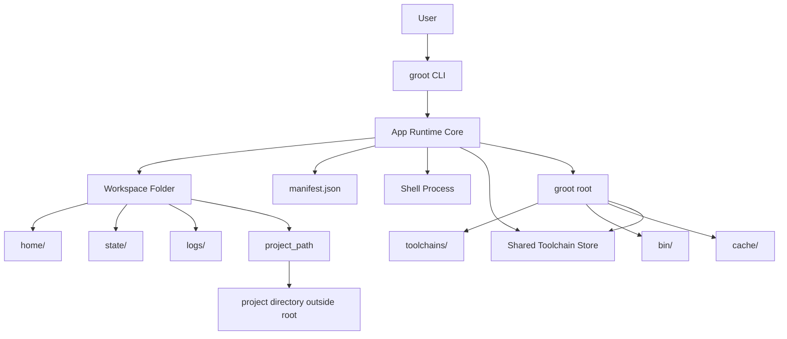

## 🪴 Groot

Groot is a workspace-first runtime layer for local development.

It gives each workspace its own home directory and manifest, while keeping shared runtime state under a single `~/.groot` root. The current version is focused on workspace lifecycle, manifest management, project binding, toolchain installation, and shell activation.

## Current Scope

- Initialize a Groot root under `~/.groot`
- Create and delete workspaces
- Bind a workspace to an existing project directory
- Attach toolchain requirements to a workspace manifest
- Install attached toolchains into the shared Groot toolchain root
- Open a workspace shell with workspace-scoped `HOME` and XDG directories
- Run one-off commands inside the workspace runtime

## Principles

- All Groot state lives under one root directory: `~/.groot`
- Each workspace has its own isolated `HOME`
- Source code stays in its normal location outside the Groot runtime root
- Toolchain requirements are declared in `manifest.json`
- Workspaces are disposable units
- Toolchain installation is moving toward a shared global store, not per-workspace duplication

## Runtime Layout

```bash
~/.groot/
  bin/
  cache/
  store/
  toolchains/
  workspaces/
    crawlly/
      manifest.json
      home/
      state/
      logs/
```

## Commands

```bash
groot init

groot ws create <name>
groot ws bind <name> <path>
groot ws delete <name>
groot ws shell <name>
groot ws exec <name> <cmd> [args...]
groot ws attach <name> <tool@version> [tool@version...]
groot ws install <name>
```

## Example Flow

```bash
groot init
groot ws create crawlly
groot ws bind crawlly ~/Documents/crawlly
groot ws attach crawlly go@1.25 node@22
groot ws install crawlly
groot ws shell crawlly
groot ws exec crawlly go version
```

## Supported Toolchains

Groot currently supports these toolchains:

- `bun`
- `deno`
- `go`
- `php`
- `node`
- `java`
- `python`
- `rust`

Current install behavior:

- `bun` downloads the official prebuilt ZIP archive for the current OS and architecture
- `deno` downloads the official prebuilt ZIP archive for the current OS and architecture
- `go` downloads the official prebuilt archive for the current OS and architecture
- `php` downloads the official source tarball and builds it locally
- `node` downloads the official prebuilt archive for the current OS and architecture
- `java` resolves the latest matching Temurin JDK for the requested feature version
- `python` downloads the official source tarball and builds it locally
- `rust` bootstraps through `rustup-init` inside the workspace-managed toolchain root

## Version Semantics

Version values are stored in the manifest and interpreted per toolchain.

- `bun@1.3.10` means an exact Bun release
- `deno@2.7.5` means an exact Deno release
- `go@1.26.1` means an exact Go release
- `php@8.5.4` means an exact PHP source release
- `node@25.8.1` means an exact Node release
- `java@21` means the latest available Temurin JDK for feature version `21`
- `python@3.14` means the latest available Python `3.14.x` source release
- `python@3.14.0` means an exact Python source release
- `rust@stable` means the Rust stable channel via `rustup`

Examples:

```bash
groot ws attach frontend bun@1.3.10 deno@2.7.5
groot ws attach backend go@1.26.1 node@25.8.1
groot ws attach api java@21
groot ws attach legacy php@8.5.4
groot ws attach scripts python@3.14
groot ws attach scripts python@3.14.0
groot ws attach systems rust@stable
```

## Workspace Manifest

Each workspace stores its desired state in `manifest.json`.

Example:

```json
{
  "schema_version": 1,
  "created_at": "2026-03-04T15:43:56.144288Z",
  "name": "crawlly",
  "project_path": "/Users/example/Documents/crawlly",
  "packages": [
    {
      "name": "go",
      "version": "1.25"
    },
    {
      "name": "node",
      "version": "22"
    }
  ],
  "services": [],
  "env": {}
}
```

## Current Behavior Notes

- `ws attach` currently appends toolchain requirements into `packages`
- `services` exists in the schema but is not actively used yet
- `ws bind` stores the project location in `project_path`
- `ws install` downloads and installs attached toolchains into the shared Groot toolchain root
- `ws shell` ensures attached toolchains are installed, prepends their `bin` directories to `PATH`, and sets toolchain-specific env vars when needed
- `ws shell` starts in the bound `project_path` when present, otherwise in the workspace root under `~/.groot/workspaces/<name>`
- `ws exec` runs a specific command in the same workspace environment and working directory resolution used by `ws shell`
- host `PATH` is still inherited after Groot-managed bin paths, so isolation is intentionally soft for now
- `php` and `python` installation are slower than the other supported toolchains because they are built from source

## Architecture Overview


