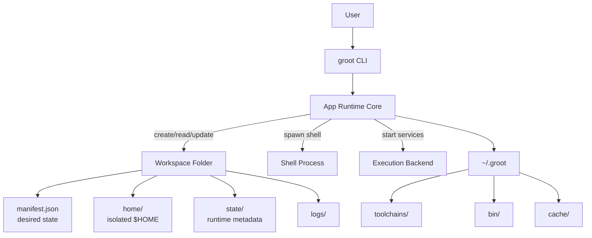

## 🪴 Groot

A workspace-first runtime layer that keeps your system clean.

Groot is a lightweight control plane that makes environments first-class citizens.

Instead of installing tools globally and allowing them to mutate your system state, Groot scopes toolchains and execution to isolated workspaces.

Delete a workspace → everything related to it is gone.


## Principles

    •	All state lives under a single root directory: ~/.groot
	•	Each workspace has its own isolated $HOME
	•	Toolchains are installed into a shared store
	•	Processes launched via Groot run inside a workspace context
	•	No global mutation of your system

## Runtime Layout

```bash
~/.groot/
  store/          # installed toolchains & binaries
  workspaces/
    acme/
      manifest.yaml
      home/       # workspace-scoped $HOME
      state/
      project/
      logs/
```

## Architecture Overview

