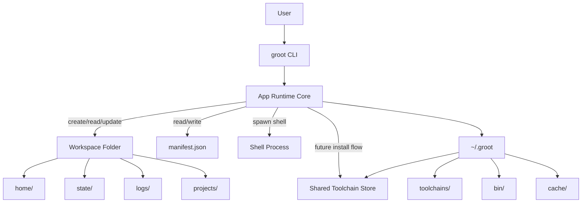

## 🪴 Groot

Groot is a workspace-first runtime layer for local development.

It gives each workspace its own home directory and manifest, while keeping shared runtime state under a single `~/.groot` root. The current version is focused on workspace lifecycle, manifest management, and shell activation.

## Current Scope

- Initialize a Groot root under `~/.groot`
- Create and delete workspaces
- Attach toolchain requirements to a workspace manifest
- Open a workspace shell with workspace-scoped `HOME` and XDG directories
- Scaffold an `install` command that reads the manifest and is the entrypoint for toolchain installation work

## Principles

- All Groot state lives under one root directory: `~/.groot`
- Each workspace has its own isolated `HOME`
- Toolchain requirements are declared in `manifest.json`
- Workspaces are disposable units
- Toolchain installation is moving toward a shared global store, not per-workspace duplication

## Runtime Layout

```bash
~/.groot/
  bin/
  cache/
  store/
  toolchains/
  workspaces/
    crawlly/
      manifest.json
      home/
      state/
      logs/
      projects/
```

## Commands

```bash
groot init

groot ws create <name>
groot ws del <name>
groot ws shell <name>
groot ws attach <name> <tool@version> [tool@version...]
groot ws install <name>
```

## Example Flow

```bash
groot init
groot ws create crawlly
groot ws attach crawlly go@1.25 node@22
groot ws install crawlly
groot ws shell crawlly
```

## Workspace Manifest

Each workspace stores its desired state in `manifest.json`.

Example:

```json
{
  "schema_version": 1,
  "created_at": "2026-03-04T15:43:56.144288Z",
  "name": "crawlly",
  "packages": [
    {
      "name": "go",
      "version": "1.25"
    },
    {
      "name": "node",
      "version": "22"
    }
  ],
  "services": [],
  "env": {}
}
```

## Current Behavior Notes

- `ws attach` currently appends toolchain requirements into `packages`
- `services` exists in the schema but is not actively used yet
- `ws install` currently loads the manifest and is the intended hook for download/install work
- `ws shell` already isolates `HOME` and XDG directories, but host `PATH` is still inherited for now

## Architecture Overview


