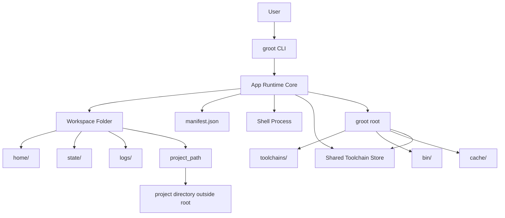

# Groot Reference

This document collects the lower-level reference material that is too detailed for the top-level README.

## Top-Level CLI

Current top-level commands:

```bash
groot enter <path>
groot event <command> [args]
groot exec <path> <cmd> [args...]
groot export <path>
groot import <export.json|-> --project-path <path> [--workspace-name name]
groot init
groot mcp [--project path ...] [--workspace name ...]
groot open <path> [--ide code|cursor|zed|...] [--attach-detected|--install-detected|--setup|--setup-detected] [-- args...]
groot service <command> [args]
groot shell-hook
groot shell-hook install
groot status <path> [--json]
groot task <command> [args]
groot ws <command> [args]
```

## Workspace Commands

Lower-level workspace commands:

```bash
groot ws attach <name> <tool@version> [tool@version...]
groot ws bind <name> <path>
groot ws create <name>
groot ws delete <name>
groot ws env <name>
groot ws exec <name> <cmd> [args...]
groot ws gc
groot ws install <name>
groot ws open <name> [--ide code|cursor|zed|...]
groot ws shell <name>
groot ws unbind <name>
```

Use `groot ws ...` when you want explicit workspace-by-name control instead of the normal path-first UX.

## Shell Hook

To make integrated terminals automatically re-enter the strict Groot runtime after `ws open`, install the shell hook into your shell rc file.

Recommended:

```bash
groot shell-hook install
```

This currently supports `zsh` and `bash`, and installs a managed block into the detected rc file:

```bash
# >>> groot shell hook >>>
eval "$(groot shell-hook)"
# <<< groot shell hook <<<
```

Behavior:

- when `GROOT_WORKSPACE` is not set, the hook prints nothing and does nothing
- when `GROOT_WORKSPACE` is set, the hook reapplies the strict workspace runtime for the shell
- this keeps `ws open` editor-agnostic while letting integrated terminals use Groot-managed toolchain precedence automatically
- `groot shell-hook install` is idempotent and will not add the managed block twice

## Supported Toolchains

Groot currently supports:

- `bun`
- `deno`
- `go`
- `java`
- `node`
- `php`
- `python`
- `rust`

Current install behavior:

- `bun` downloads the official prebuilt ZIP archive for the current OS and architecture
- `deno` downloads the official prebuilt ZIP archive for the current OS and architecture
- `go` downloads the official prebuilt archive for the current OS and architecture
- `java` resolves the latest matching Temurin JDK for the requested feature version
- `node` downloads the official prebuilt archive for the current OS and architecture
- `php` downloads the official source tarball and builds it locally
- `python` downloads the official source tarball and builds it locally
- `rust` bootstraps through `rustup-init` inside the workspace-managed toolchain root

## Version Semantics

Version values are stored in the manifest and interpreted per toolchain.

- `bun@1.3.10` means an exact Bun release
- `deno@2.7.5` means an exact Deno release
- `go@1.26.1` means an exact Go release
- `go@1.26` means the latest available stable Go `1.26.x` release
- `go@latest` means the latest available stable Go release
- `java@21` means the latest available Temurin JDK for feature version `21`
- `node@25.8.1` means an exact Node release
- `php@8.5.4` means an exact PHP source release
- `python@3.14` means the latest available Python `3.14.x` source release
- `python@3.14.0` means an exact Python source release
- `rust@stable` means the Rust stable channel via `rustup`

Examples:

```bash
groot ws attach frontend bun@1.3.10 deno@2.7.5
groot ws attach backend go@1.26.1 node@25.8.1
groot ws attach backend go@1.26
groot ws attach backend go@latest
groot ws attach api java@21
groot ws attach legacy php@8.5.4
groot ws attach scripts python@3.14
groot ws attach scripts python@3.14.0
groot ws attach systems rust@stable
```

## Manifest

Each workspace stores desired runtime configuration in `manifest.json`.

Example:

```json
{
  "schema_version": 1,
  "created_at": "2026-03-04T15:43:56.144288Z",
  "name": "crawlly",
  "project_path": "/Users/example/Documents/crawlly",
  "packages": [
    {
      "name": "go",
      "version": "1.25"
    },
    {
      "name": "node",
      "version": "22"
    }
  ],
  "tasks": [
    {
      "name": "test",
      "command": ["go", "test", "./..."],
      "cwd": "."
    }
  ],
  "services": [
    {
      "name": "api",
      "command": ["node", "server.js"],
      "cwd": ".",
      "restart": "manual"
    }
  ],
  "env": {}
}
```

Current meaning:

- `packages` are the active toolchain declarations used by runtime ownership, install, and exec flows
- toolchains that support alias or series resolution are normalized to concrete versions before Groot writes them into the manifest
- `tasks` are optional manifest declarations that can be started as tracked task runs
- `services` are optional manifest declarations for long-running named runtime resources
- live task/service execution state belongs under the workspace `state/` directory, not in the manifest

## Runtime Behavior Notes

Current behavior details:

- `ws attach` validates `name@version` specs, rejects unsupported toolchains, and updates existing package entries by name
- `ws bind` stores the project location in `project_path`
- `ws unbind` clears `project_path` without deleting the workspace runtime
- `open` resolves a workspace from a project path and auto-creates/binds one on first open when needed
- `open` scans a newly seen project for likely runtimes and uses a warn-only first-open policy by default
- `open` warns when detected runtimes are still undeclared in the workspace manifest, because commands may fall back to host toolchains until those runtimes are attached and installed
- `GROOT_STRICT_RUNTIME=1` turns those warnings into hard failures for the top-level path-based commands `open`, `enter`, and `exec`
- `enter` resolves a workspace from a project path and opens the strict workspace shell
- `exec` resolves a workspace from a project path and runs one strict-runtime command
- `status` resolves a workspace from a project path, creates and binds one automatically on first use, and shows whether runtimes are currently Groot-managed or still falling back to the host
- `ws install` downloads and installs attached toolchains into the shared Groot toolchain root
- `ws gc` removes unreferenced toolchain versions from the shared Groot toolchain root
- `ws shell` ensures attached toolchains are installed, prepends their `bin` directories to `PATH`, and sets toolchain-specific env vars when needed
- `ws shell` starts in the bound `project_path` when present, otherwise in the workspace root under `~/.groot/workspaces/<name>`
- `ws env` prints shell exports for the resolved workspace runtime and includes `GROOT_WORKDIR` for the chosen working directory
- workspace runtimes export `GROOT_HOME`, so nested `groot` commands keep using the shared Groot root instead of falling back to the workspace `HOME`
- `ws exec` runs a specific command in the same workspace environment and working directory resolution used by `ws shell`
- `ws open` launches an IDE or GUI program in a softer runtime that keeps the project cwd, toolchain `PATH`, and `GROOT_*` vars while preserving the user's normal `HOME`
- `shell-hook` turns a shell with `GROOT_WORKSPACE` set back into the strict workspace runtime
- host `PATH` is filtered before reuse in the strict runtime, so user-home shims and editor-specific entries are dropped while system paths remain available
- `ws open` keeps the host `PATH` and `HOME` so GUI IDEs can behave more like normal desktop apps
- archive extraction rejects path traversal and staged archive installs replace the final toolchain dir only after a successful extract
- `php` and `python` installation are slower than the other supported toolchains because they are built from source

Tasks:

- tasks are tracked execution records, not long-running named services
- each task run gets its own stdout/stderr logs under the workspace logs directory
- terminal task events are emitted when Groot observes final state through task status, list, or logs

Services:

- services are manifest-declared only in V1
- services are current named runtime resources, not historical run records
- each service has one current stdout/stderr log pair under the workspace logs directory
- service events currently cover only `service.started`, `service.stopped`, and `service.failed`
- service failure events are emitted when Groot observes an exited service through service status, list, or logs
- restart policy is stored in the manifest but there is no restart engine yet

Events:

- `timestamp` is when Groot emitted the event record
- `payload.finished_at` is when the task or service actually finished, if known

## Architecture Overview


